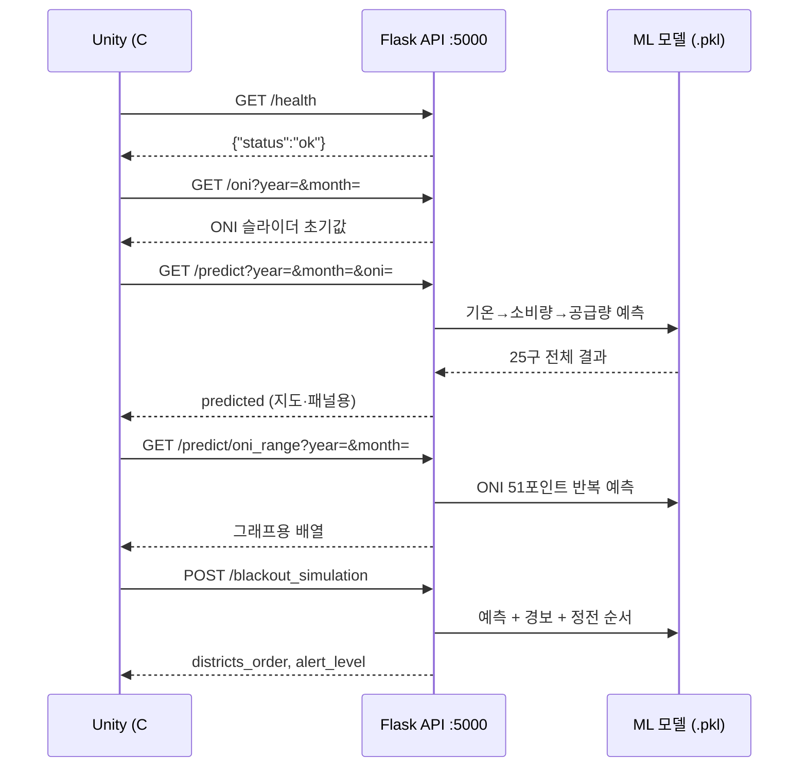

# SmartCity — 서울 기상·전력 시뮬레이터

Unity 기반 서울시 스마트시티 시뮬레이터. ENSO(ONI) 기후 신호와 연도 슬라이더를 조정하면
기온 예측 → 공간 열섬 보정 → 전력소비·공급량 예측 → 경보단계 → 블랙아웃 시뮬레이션까지
순차 파이프라인이 실행되고, Unity 씬이 실시간으로 업데이트됩니다.

---

## 목차

1. [프로젝트 목표](#1-프로젝트-목표)
2. [전체 아키텍처](#2-전체-아키텍처)
3. [모델 파이프라인](#3-모델-파이프라인)
4. [MVP vs 전체 구현](#4-mvp-vs-전체-구현)
5. [데이터 현황](#5-데이터-현황)
6. [디렉터리 구조](#6-디렉터리-구조)
7. [설치 및 실행](#7-설치-및-실행)
8. [API 명세](#8-api-명세)
9. [시뮬레이션 로직](#9-시뮬레이션-로직)
10. [데이터 준비 가이드](#10-데이터-준비-가이드)
11. [알려진 데이터 품질 이슈](#11-알려진-데이터-품질-이슈)

---

## 1. 프로젝트 목표

| 항목       | 내용                                                         |
| ---------- | ------------------------------------------------------------ |
| 대상 지역  | 서울시 25개 구 / 424개 행정동                                |
| 시간 범위  | 2006 ~ 2030년 (과거 재현 + 미래 시나리오)                    |
| 기후 변수  | ONI (엘니뇨-라니냐 지수), 연도 추세                          |
| 예측 대상  | 월별 전력소비량(구×용도), 전국 공급량, 공급예비율            |
| 시뮬레이션 | 경보단계 판정, 구별 블랙아웃 순차 차단                       |
| Unity 연동 | Flask REST API → C# HttpClient → 버드뷰 / 건물 패널 업데이트 |

---

## 2. 전체 아키텍처

```
[Unity 씬]
  ├── ONI 슬라이더 / 연도 슬라이더
  ├── 버드뷰 (구별 열섬 색상)
  ├── 건물 클릭 패널 (SHAP 기여도 바차트)
  └── 경보등 / 블랙아웃 구역 표시
        │  C# HttpClient
        ▼
[Flask REST API]  python/api/flask_app.py
  ├── POST /predict_and_explain
  └── POST /blackout_simulation
        │
        ▼
[Python 파이프라인]
  1. 기온 예측 (선형회귀, ASOS 108 기반)
        │
        ▼
  2. 공간 열섬 보정 (Delta Method)
     base_offset(구/동) × intensity_multiplier(ws, ta_anomaly)
        │
        ▼
     CDD / HDD 변환
        │
     ┌──┴──────────────────┐
     ▼                     ▼
  3. 소비량 예측        4. 공급량 예측
     (XGBoost)             (다항 선형회귀)
     + SHAP 기여도          → 예비율 → 경보단계
     └──┬──────────────────┘
        ▼
     블랙아웃 시뮬레이션
```

### Unity ↔ API 호출 흐름



---

## 3. 모델 파이프라인

### 단계별 모델 요약

| 단계               | 모델            | 입력                                       | 출력                     | 해석 방법          |
| ------------------ | --------------- | ------------------------------------------ | ------------------------ | ------------------ |
| **1. 기온 예측**   | 선형회귀        | ONI, year, month(더미)                     | 서울 대표 월평균기온 (℃) | β 계수             |
| **2. 열섬 보정**   | 선형회귀 (보조) | 풍속, 기온편차                             | intensity_multiplier     | β 계수             |
| **3. 소비량 예측** | XGBoost         | CDD/HDD, year, month, district, usage_type | 구×용도별 소비량 (kWh)   | SHAP TreeExplainer |
| **4. 공급량 예측** | 다항 선형회귀   | CDD/HDD, year, month                       | 공급량 (MW), 예비율 (%)  | β 계수             |

### 1번 모델 — 기온 예측 (LinearRegression)

```
ta_mean(year, month, ONI) = β0 + β(ONI)·ONI + β(year)·year + Σ β(month_k)·I(month=k)
```

- β(ONI) ≈ +0.3 ~ +0.5 ℃/unit
- β(year) ≈ +0.03 ~ +0.05 ℃/yr
- 아티팩트: `model/artifacts/temp_trend_model.pkl`

### 2번 모델 — 공간 열섬 보정 (Delta Method)

```
ta_local = ta_mean_pred + base_offset(구 또는 동) × intensity_multiplier(ws, ta_anomaly)
```

- `base_offset` = 지역 관측소 평년 일최저기온 − ASOS(108) 평년 일최저기온
- 열섬 판정: offset × multiplier ≥ 2.0 ℃
- **MVP**: AWS 구 단위 / **전체**: 동네예보 동 단위 (아래 [섹션 4](#4-mvp-vs-전체-구현) 참조)

### 3번 모델 — 소비량 예측 (XGBoost)

| 피처            | 설명                                                         |
| --------------- | ------------------------------------------------------------ |
| `cdd`           | 냉방도일 Σmax(0, ta−24℃)                                     |
| `hdd`           | 난방도일 Σmax(0, 18℃−ta)                                     |
| `year`          | 기저소비 증가 추세                                           |
| `month`         | 계절성                                                       |
| `district_id`   | 구별 기저 소비 수준                                          |
| `usage_id`      | 용도별 반응 패턴 (7종: 주택/일반/교육/산업/농사/가로등/심야) |
| `thi`           | 불쾌지수 = 1.8T − 0.55(1−RH/100)(1.8T−26) + 32               |
| `oni`, `oni_3m` | ENSO 신호 및 3개월 이동평균                                  |

- 아티팩트: `model/artifacts/consumption_xgb.pkl`, `consumption_encoders.pkl`

### 4번 모델 — 공급량 예측 (PolynomialFeatures + LinearRegression)

- degree=2, supply_mw / reserve_rate 각각 개별 학습
- β(cdd) < 0 for reserve_rate (폭염→수요↑→예비율↓)
- 아티팩트: `model/artifacts/supply_regression.pkl`

---

## 4. MVP vs 전체 구현

모델 구조는 MVP와 전체 구현이 완전히 동일. **입력 데이터의 해상도·기간만 교체**.

### 현재 MVP

```
공간 보정 입력: AWS 자동기상관측소 (구 단위, 2020~2024, 5개년)
  → base_offset(25개 구) + intensity_multiplier 학습
  → CDD/HDD → 소비량/공급량 예측 → 경보단계 → 블랙아웃
  ← 전체 파이프라인 1회 완성 ←
```

- 버드뷰: 25개 구 단위 열섬 색상
- 소비량 모델 district 피처: 구 단위 (KEPCO 데이터와 동일 단위, 추가 변환 불필요)

### 추후 업그레이드 (선택, 독립적)

| 업그레이드      | 변경 내용                                 | 변경 범위                                                              |
| --------------- | ----------------------------------------- | ---------------------------------------------------------------------- |
| **해상도 향상** | AWS 구 단위 → 동네예보 동 단위 (424개 동) | `base_offset` dict만 교체. `dong_temp.synthesize()` 코드 불변          |
| **기간 확장**   | 5년(2020~2024) → 8~10년                   | AWS 데이터 추가 후 `fit_intensity_multiplier_gu()` 재실행. 계수만 갱신 |

```python
# MVP 호출 예시
from python.preprocess.dong_offset import (
    load_aws_daily, calc_gu_offset, fit_intensity_multiplier_gu
)
from python.model.dong_temp import synthesize

aws_daily  = load_aws_daily()
gu_offsets = calc_gu_offset(aws_daily, asos_daily)      # {구이름: offset}
mult_model = fit_intensity_multiplier_gu(aws_daily, asos_daily, gu_offsets)

result = synthesize(year=2030, month=8, oni=1.5,
                    base_offsets=gu_offsets,             # 구 단위 전달
                    temp_model=temp_model,
                    multiplier_model=mult_model)
# result: DataFrame(gu, ta_synth, is_heat_island) — 25행

# 해상도 업그레이드 시 (모델 코드 변경 없이)
from python.preprocess.dong_offset import expand_gu_to_dong
dong_offsets = expand_gu_to_dong(gu_offsets)            # {동이름: offset} — 424개

result = synthesize(..., base_offsets=dong_offsets)     # 424행으로 자동 확장
```

---

## 5. 데이터 현황

| 데이터                            | 경로                                                | 범위                         | 상태            |
| --------------------------------- | --------------------------------------------------- | ---------------------------- | --------------- |
| ASOS 시간별 기상 (지점 108, 종로) | `data/file/asos_weather_data/asos_108_hourly.csv`   | 2006.01 ~ 2026.05, 178,943행 | ✅ 완료         |
| KEPCO 구별·용도별 판매량          | `data/file/kepco_electricity_sales/*.xlsx`          | 2006 ~ 2026                  | ✅ 완료         |
| EPSIS 전국 공급량·예비율          | `data/file/epsis_elec_supply.csv`                   | 일별                         | ✅ 완료         |
| ONI 월별 지수                     | `data/file/oni.csv`                                 | 1950 ~ 현재                  | ✅ 완료         |
| 서울 행정동 격자좌표              | `data/file/seoul_dong_grid.csv`                     | 424개 동                     | ✅ 완료         |
| **AWS 구별 일별 기온** (MVP)      | `data/file/aws_weather_data/`                       | 2020 ~ 2026 (시간별 원시)    | ✅ 완료         |
| 동별 단기예보 아카이브 (전체)     | `data/file/dong_weather_data/`                      | 추후 수집                    | 🔜 업그레이드용 |

---

## 6. 디렉터리 구조

```
SmartCity/
├── data/
│   ├── extract/
│   │   ├── asos_api_broadcast.py               # ASOS 시간별 기상 수집 (지점 108)
│   │   ├── dong_forecast_archive.py            # 동별 단기예보 아카이브 (전체 구현용)
│   │   ├── aws_hourly_to_daily.py            # OBS_AWS_TIM → 구별 일별 CSV 변환
│   │   ├── build_seoul_dong_grid.py            # 서울 동 격자좌표 CSV 생성 (1회)
│   │   └── kepco_electricity_sales_crawling.py # KEPCO xlsx Playwright 크롤러
│   └── file/
│       ├── asos_weather_data/                  # ASOS 원시 CSV
│       ├── kepco_electricity_sales/            # KEPCO xlsx (2006~2026)
│       ├── aws_weather_data/                   # AWS 구별 기온 (MVP)
│       │   ├── OBS_AWS_TIM_*.csv               # KMA 시간별 원시 (지점, 지점명, 일시, 기온)
│       │   └── aws_seoul_gu_daily.csv          # 집계본: gu,date,ta_min,ta_max,ta_mean,ws_mean
│       ├── dong_weather_data/                  # 동별 예보 아카이브 (업그레이드용)
│       ├── epsis_elec_supply.csv
│       ├── oni.csv
│       └── seoul_dong_grid.csv
│
├── python/
│   ├── preprocess/
│   │   ├── asos_daily.py        # ASOS 시간→일/월 집계
│   │   ├── oni_loader.py        # ONI 로드 및 3개월 이동평균
│   │   ├── supply_loader.py     # EPSIS 공급량 로드
│   │   ├── kepco_merge.py       # KEPCO xlsx 통합 (서울 구·용도별)
│   │   └── dong_offset.py       # base_offset + intensity_multiplier
│   │                            #   MVP 함수:  load_aws_daily / calc_gu_offset
│   │                            #              fit_intensity_multiplier_gu
│   │                            #   전체 함수: load_dong_archive / calc_base_offset
│   ├── model/
│   │   ├── temp_trend.py        # 1번: 기온 예측 선형회귀
│   │   ├── cdd_hdd.py           # CDD/HDD 계산
│   │   ├── dong_temp.py         # 2번: 공간 열섬 합성 (MVP·전체 공통 코드)
│   │   ├── consumption_xgb.py   # 3번: 소비량 XGBoost
│   │   ├── supply_regression.py # 4번: 공급량 다항 선형회귀
│   │   └── shap_explain.py      # SHAP 로컬 기여도 (3번 모델용)
│   ├── simulation/
│   │   ├── alert_level.py       # 예비율 → 경보단계 (5단계)
│   │   ├── demand_reduction.py  # 수요감축필요도 지수
│   │   └── blackout.py          # 블랙아웃 순차 시뮬레이션
│   ├── api/
│   │   └── flask_app.py         # REST API 서버
│   ├── train_pipeline.py        # 전체 학습 진입점
│   └── eda_regression.ipynb     # EDA + FE + SHAP 분석 노트북
│
├── Unity/                        # Unity 프로젝트 (C# 스크립트)
├── requirements.txt
└── README.md
```

---

## 7. 설치 및 실행

### 환경 설정

```bash
pip install -r requirements.txt
playwright install chromium   # KEPCO 크롤러 사용 시
```

`.env` 파일에 공공데이터포털 API 키 설정:

```
OPEN_API=your_service_key_here
```

### AWS 데이터 준비 (MVP)

KMA 기상자료개방포털에서 서울 AWS **시간**자료(`OBS_AWS_TIM`)를 연도별로 내려받아 저장:

```
data/file/aws_weather_data/OBS_AWS_TIM_*.csv
```

원시 컬럼: `지점, 지점명, 일시, 기온(°C)` (풍속 없음 — intensity_multiplier 학습 시 ASOS 풍속으로 대체)

일별 집계 CSV 생성:

```bash
python data/extract/aws_hourly_to_daily.py
# 출력: data/file/aws_weather_data/aws_seoul_gu_daily.csv
```

`load_aws_daily()`는 집계본 CSV가 있으면 우선 사용하고, 없으면 `OBS_AWS_TIM_*.csv`에서 메모리 집계.

지점→구 매핑은 `python/preprocess/dong_offset.py`의 `AWS_STN_TO_GU` 참조 (25개 구 1:1).
기상청(410)→종로구, 현충원(889)→동작구. 남현·한강 등 비대표 지점은 제외.

### MVP 모델 학습

```bash
# 프로젝트 루트에서 실행
python -m python.train_pipeline
```

순서: ASOS → ONI → AWS → KEPCO → EPSIS 로드 → 기온 회귀 → 구별 오프셋 → CDD/HDD → 소비량 XGBoost → 공급량 회귀  
결과물: `model/artifacts/*.pkl`

### Flask API 서버 실행

```bash
python -m python.api.flask_app
# 기본 포트: 5000
```

### EDA 노트북 실행

```bash
cd python
jupyter notebook eda_regression.ipynb
```

---

## 8. API 명세

### `POST /predict_and_explain`

단일 구·용도·월에 대한 소비량 예측 + SHAP 기여도 반환.

**요청 본문**

```json
{
  "district": "강남구",
  "usage_type": "산업용",
  "year": 2028,
  "month": 8,
  "oni": 1.5
}
```

**응답**

```json
{
  "ta_mean_pred": 28.4,
  "cdd": 310.0,
  "hdd": 0.0,
  "consumption_mwh": 485230.0,
  "supply_mw": 98500.0,
  "reserve_rate": 8.3,
  "alert_level": 2,
  "alert_label": "주의",
  "shap": {
    "냉방도일(CDD)": { "shap": 42100, "pct": 38.2 },
    "용도": { "shap": 31500, "pct": 28.5 },
    "연도(추세)": { "shap": 15200, "pct": 13.8 },
    "지역(구)": { "shap": 10400, "pct": 9.4 },
    "월(계절성)": { "shap": 6800, "pct": 6.2 },
    "난방도일(HDD)": { "shap": 0, "pct": 0.0 },
    "불쾌지수(THI)": { "shap": 2400, "pct": 2.2 },
    "ONI": { "shap": 1300, "pct": 1.2 },
    "ONI_3개월평균": { "shap": 800, "pct": 0.7 }
  },
  "demand_reduction_index": 194092.0
}
```

### `POST /blackout_simulation`

25개 구 × 7개 용도 전체에 대해 블랙아웃 시뮬레이션 실행.

**요청 본문**

```json
{
  "year": 2030,
  "month": 8,
  "oni": 1.5
}
```

**응답**

```json
{
  "alert_level": 3,
  "alert_label": "경계",
  "blackout_count": 12,
  "total_cut_mwh": 85400.0,
  "districts_affected": ["강남구", "영등포구", "종로구"],
  "blackout_items": [
    { "district": "강남구", "usage_type": "산업용", "consumption_mwh": 42000 }
  ]
}
```

### `GET /health`

```json
{ "status": "ok" }
```

---

## 9. 시뮬레이션 로직

### 경보단계 (공급예비율 기준)

| 단계            | 예비율   | 위기계수 |
| --------------- | -------- | -------- |
| NORMAL (정상)   | ≥ 15%    | 0.0      |
| CAUTION (관심)  | 10 ~ 15% | 0.2      |
| WARNING (주의)  | 7 ~ 10%  | 0.4      |
| ALERT (경계)    | 5 ~ 7%   | 0.7      |
| CRITICAL (심각) | < 5%     | 1.0      |

### 수요감축필요도 지수

```
demand_reduction_index = consumption_mwh × crisis_coef × (1 - blackout_immunity)
```

| 용도      | 블랙아웃 면제율 (immunity) |
| --------- | -------------------------- |
| 병원·응급 | 0.0 (완전 면제)            |
| 주택용    | 0.3                        |
| 교육용    | 0.4                        |
| 가로등    | 0.5                        |
| 농사용    | 0.5                        |
| 일반용    | 0.6                        |
| 심야      | 0.8                        |
| 산업용    | 0.9 (최우선 차단)          |

### 블랙아웃 우선순위

경계(ALERT) 이상 단계에서 자동 발동. 목표 감축량 달성까지 수요감축지수 내림차순으로 구→용도 순차 차단.

- ALERT: 총 소비량의 15% 감축 목표
- CRITICAL: 총 소비량의 30% 감축 목표

---

## 10. 데이터 준비 가이드

### ASOS 기상 수집

```bash
python data/extract/asos_api_broadcast.py
# .env의 OPEN_API 키 필요
# 출력: data/file/asos_weather_data/asos_108_hourly.csv
```

### AWS 구별 기온 (MVP)

```bash
# 1) KMA에서 OBS_AWS_TIM 시간별 CSV를 data/file/aws_weather_data/ 에 저장
# 2) 일별 집계
python data/extract/aws_hourly_to_daily.py
```

### KEPCO 전력판매 현황 수집

```bash
playwright install chromium
python data/extract/kepco_electricity_sales_crawling.py
# 출력: data/file/kepco_electricity_sales/*.xlsx
```

### 동별 단기예보 아카이브 (해상도 업그레이드용)

```bash
python data/extract/build_seoul_dong_grid.py  # 격자좌표 CSV 생성
python data/extract/dong_forecast_archive.py  # 424개 동 × 일별 수집
```

> 단기예보 API는 과거 장기 아카이브 미제공. 현재 시점부터 누적 수집 필요.

---

## 11. 알려진 데이터 품질 이슈

| 이슈                  | 원인                                     | 적용된 수정                                              |
| --------------------- | ---------------------------------------- | -------------------------------------------------------- |
| MWh/kWh 단위 불일치   | 2013→2014년 기준 변경                    | `detect_unit()`으로 파일별 판별 후 ×1000 변환            |
| `"심 야"` 내부 공백   | 2015년 이후 xlsx 포맷 변경               | `.str.replace(r'\s+', '', regex=True)`                   |
| 2021 판매실적 파일    | 시군구별 분리 불가 포맷                  | `is_valid_fixed()`에서 명시 제외                         |
| 파일명 연도 파싱 오탐 | `re.search(r'(\d{4})')` → 1501 먼저 매칭 | 데이터 내 연도 컬럼 우선, fallback `(\d{4})년`           |
| "3개 용도 통합" 설    | 구전 정보                                | 전 연도 7개 계약종별 동일 확인. 선택적 `GROUP3_MAP` 제공 |

---

## 주요 참고 자료

- KMA 기상자료개방포털 (ASOS,AWS, 단기예보 자료): [data.kma.go.kr](https://data.kma.go.kr)
- KEPCO 전력판매 현황: [한국전력 통계](https://home.kepco.co.kr)
- EPSIS 전력통계정보시스템: [epsis.kpx.or.kr](https://epsis.kpx.or.kr)
- ONI (Oceanic Niño Index): [NOAA CPC](https://origin.cpc.ncep.noaa.gov)
