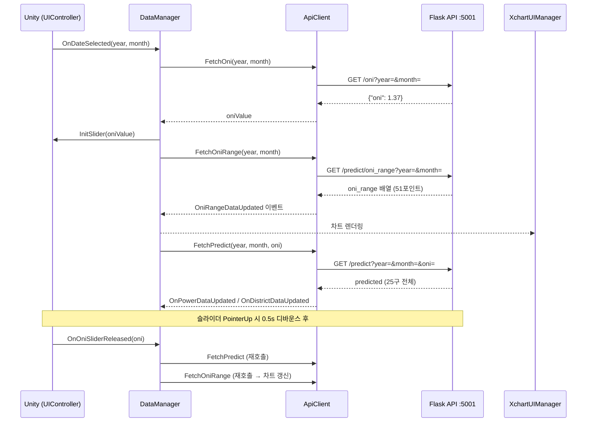
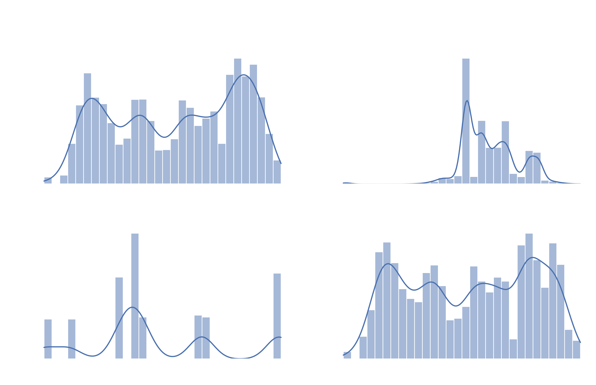
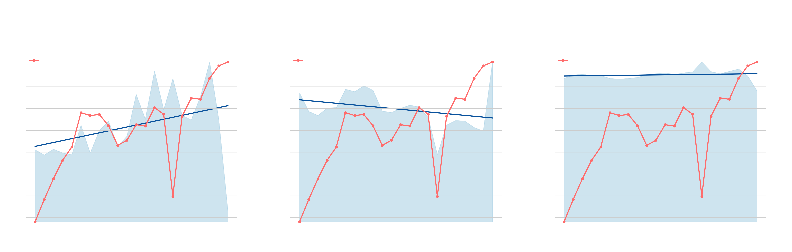
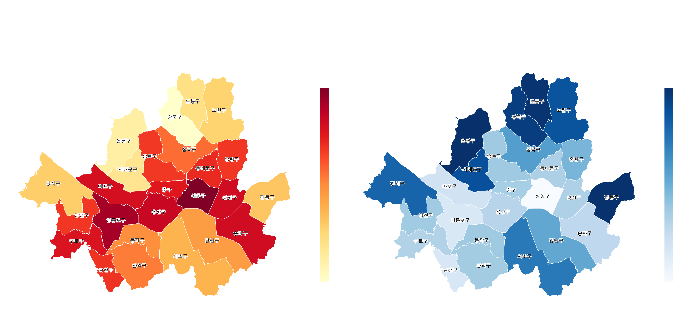
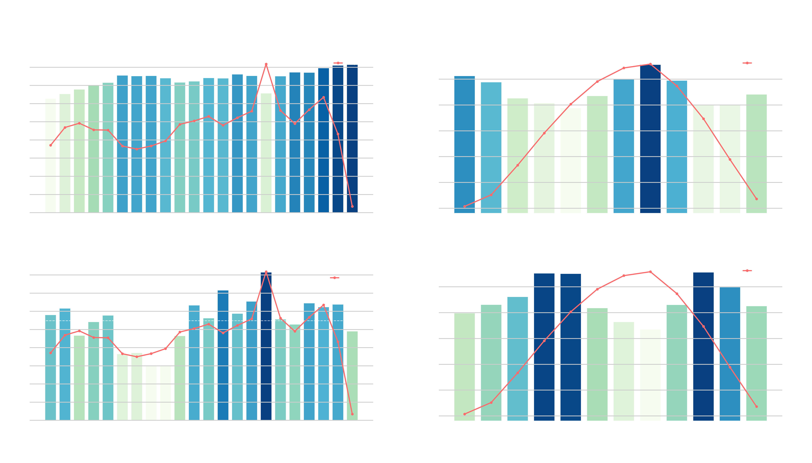
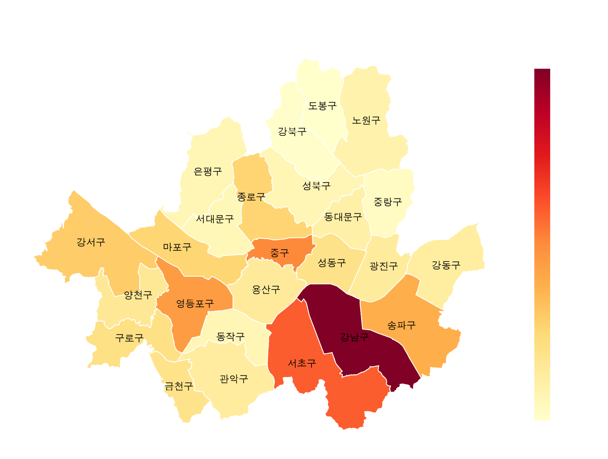
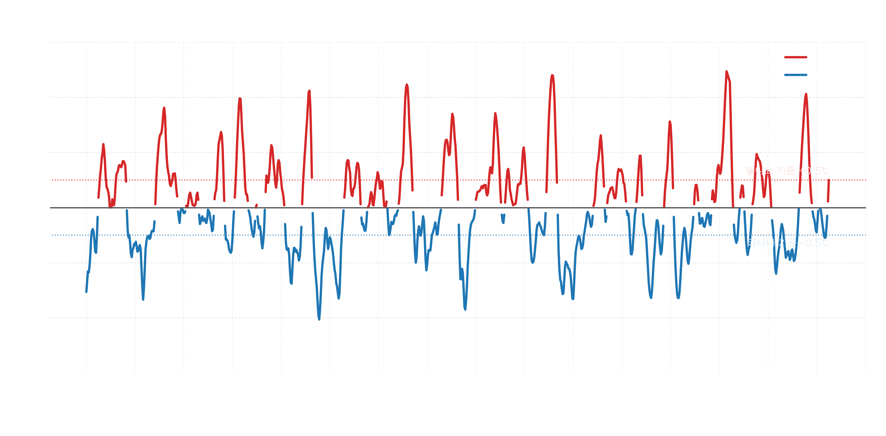
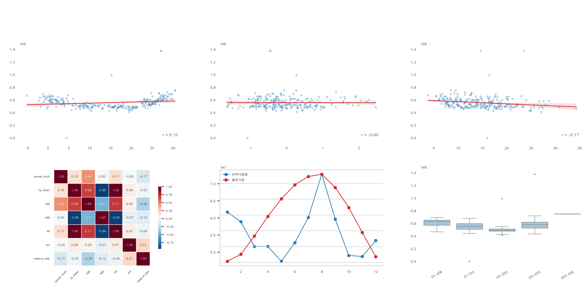

# SmartCity — 서울 기상·전력 시뮬레이터

Unity 기반 서울시 스마트시티 시뮬레이터. ENSO(ONI) 기후 신호와 연도·월을 선택하면
기온 예측 → 공간 열섬 보정 → 전력소비·공급량 예측 → 경보단계 → 블랙아웃 시뮬레이션까지
파이프라인이 실행되고, Unity 씬이 실시간으로 업데이트됩니다.

---

## 목차

1. [프로젝트 목표](#1-프로젝트-목표)
2. [전체 아키텍처](#2-전체-아키텍처)
3. [Unity ↔ API 호출 흐름](#3-unity--api-호출-흐름)
4. [모델 파이프라인](#4-모델-파이프라인)
5. [Unity 구조](#5-unity-구조)
6. [디렉터리 구조](#6-디렉터리-구조)
7. [설치 및 실행](#7-설치-및-실행)
8. [API 명세](#8-api-명세)
9. [시뮬레이션 로직](#9-시뮬레이션-로직)
10. [데이터 현황](#10-데이터-현황)
11. [알려진 데이터 품질 이슈](#11-알려진-데이터-품질-이슈)
12. [데이터 시각화](#12-데이터-시각화)

---

## 1. 프로젝트 목표

| 항목       | 내용                                                         |
| ---------- | ------------------------------------------------------------ |
| 대상 지역  | 서울시 25개 구                                               |
| 시간 범위  | 2005 ~ 2040년 (과거 재현 + 미래 시나리오)                    |
| 기후 변수  | ONI (엘니뇨-라니냐 지수), 연도·월 선택                       |
| 예측 대상  | 월별 전력소비량(구×용도), 전국 공급량, 공급예비율            |
| 시뮬레이션 | 경보단계 판정, 구별 블랙아웃 순차 차단                       |
| Unity 연동 | Flask REST API → C# HttpClient → 버드뷰 / 정보 패널 업데이트 |

---

## 2. 전체 아키텍처

```
[Unity 씬]
  ├── 연도/월 드롭다운 (TMP_Dropdown, 2005~2040)
  ├── ONI 슬라이더 (-2.5 ~ +2.5)
  ├── ONI별 에너지 현황 차트 (XCharts LineChart)
  ├── 버드뷰 (구별 열섬 색상)
  ├── 정보 패널 (구 클릭 → 소비량·기온·예비율)
  └── 경보등 / 블랙아웃 구역 표시
        │  C# HttpClient (ApiClient.cs)
        ▼
[Flask REST API]  python/api/flask_app.py  (포트: 5001)
  ├── GET  /health
  ├── GET  /oni
  ├── GET  /predict
  ├── GET  /predict/oni_range
  └── POST /blackout_simulation
        │
        ▼
[Python 파이프라인]
  1. 기온 예측 (선형회귀, ASOS 108 기반)
        │
        ▼
  2. 공간 열섬 보정 (Delta Method, gu_offset)
        │
        ▼
     CDD / HDD 변환
        │
     ┌──┴──────────────────┐
     ▼                     ▼
  3. 소비량 예측        4. 공급량/최대전력 예측
     (XGBoost)             (다항 선형회귀)
     구×용도별             → 예비율 수식 계산
     └──┬──────────────────┘
        ▼
     블랙아웃 시뮬레이션
```

---

## 3. Unity ↔ API 호출 흐름



---

## 4. 모델 파이프라인

| 단계               | 모델          | 출력                         | 아티팩트                        |
| ------------------ | ------------- | ---------------------------- | ------------------------------- |
| **1. 기온 예측**   | 선형회귀      | 서울 월평균기온 (℃)          | `temp_trend_model.pkl`          |
| **2. 열섬 보정**   | Delta Method  | 구별 예측기온 (℃)            | `gu_offset_params.pkl`          |
| **3. 소비량 예측** | XGBoost       | 구×용도별 소비량 (MWh)       | `consumption_xgb.pkl`           |
| **4. 공급량 예측** | 다항 선형회귀 | 공급량(MW) + 최대전력(MW)    | `supply_model.pkl`              |
| **예비율 계산**    | 수식          | (supply−peak) / peak × 100   | —                               |

피처 공통: `year, month, oni, cdd, hdd, district, usage_type`  
학습 진입점: `python -m python.train_pipeline`

---

## 5. Unity 구조

### C# 스크립트 구성

```
Assets/Scripts/
├── Core/
│   ├── Managers/
│   │   ├── BuildingManager.cs       # 건물 오브젝트 관리
│   │   ├── DistrictManager.cs       # 구 오브젝트 관리
│   │   └── PowerGridManager.cs      # 전력망 데이터 수신
│   └── Objects/
│       ├── BuildingObject.cs        # 개별 건물 오브젝트
│       └── DistrictObject.cs        # 개별 구 오브젝트
├── Data/
│   ├── ApiClient.cs                 # Flask API HTTP 호출 (포트 5001 고정)
│   ├── DataManager.cs               # API 오케스트레이션 + 이벤트 발행
│   ├── DataParser.cs                # JSON 파싱
│   └── Models/
│       ├── BuildingData.cs
│       ├── DistrictData.cs
│       ├── OniRangeData.cs          # /predict/oni_range 응답 모델
│       └── PowerGridData.cs
├── UI/
│   ├── UIController.cs              # 드롭다운/슬라이더 입력 → 이벤트 발행
│   ├── UIManager.cs                 # 전반적 UI 상태 관리
│   ├── XchartUIManager.cs           # ONI별 에너지 차트 (XCharts)
│   ├── InfoPanelUI.cs               # 구 클릭 정보 패널
│   ├── GuEnergyPanelUI.cs           # 구별 에너지 현황 패널
│   ├── EnergyGauge.cs               # 에너지 게이지 UI
│   └── SwitchToggle.cs              # 토글 스위치
└── Utilities/
    ├── DataConverter.cs
    ├── MeshBuilder.cs
    └── enums.cs
```

### 이벤트 흐름

```
UIController
  OnDateSelected(year, month)   → DataManager
  OnOniValueChanged(oni)        → XchartUIManager (차트 수직선 실시간 이동)
  OnOniSliderReleased(oni)      → DataManager (0.5s 딜레이 후 /predict 재호출)

DataManager
  OniRangeDataUpdated           → XchartUIManager (차트 전체 갱신)
  OnPowerDataUpdated            → PowerGridManager
  OnDistrictDataUpdated         → DistrictManager / InfoPanelUI
```

### XCharts 차트 구성

- **Serie 0**: 공급예비율 (강조, 두꺼운 선)
- **Serie 1**: 기온 (흐리게)
- **Serie 2**: 공급량 (흐리게)
- **Serie 3**: 소비량 (흐리게)
- **MarkArea**: 라니냐(-2.5~-0.5) / 중립(-0.5~+0.5) / 엘니뇨(+0.5~+2.5) 배경
- **MarkLine**: 심각 5% / 경계 7% / 주의 10% / 정상 15% HLine + 현재 ONI 수직선
- x축: ONI (-2.5 / 0.0 / +2.5), 51포인트 카테고리 축

---

## 6. 디렉터리 구조

```
SmartCity/
├── .env                             # API 키, FLASK_PORT=5001
├── requirements.txt
├── README.md
│
├── data/
│   ├── extract/                     # 데이터 수집 스크립트
│   │   ├── asos_api_broadcast.py
│   │   ├── kepco_electricity_sales_crawling.py
│   │   └── aws_hourly_to_daily.py
│   ├── file/                        # 원시 데이터
│   │   ├── asos_weather_data/
│   │   ├── kepco_electricity_sales/
│   │   ├── aws_weather_data/
│   │   ├── oni.csv
│   │   └── epsis_supply_rate_final_20052026.csv
│   └── output/                      # 전처리 결과물
│       ├── gu_offset_params.pkl
│       └── epsis_supply_rate_final_20052026.csv
│
├── python/
│   ├── loader/
│   │   ├── asos_daily.py            # ASOS 시간→일/월 집계
│   │   ├── oni_loader.py            # ONI 로드
│   │   ├── supply_loader.py         # EPSIS 공급량 로드
│   │   ├── kepco_loader.py          # KEPCO 판매량 로드
│   │   └── mapping_loader.py        # 건물-구 매핑 로드
│   ├── preprocess/
│   │   ├── gu_offset.py             # 구별 기온 오프셋 계산
│   │   ├── build_temperature_gu.py  # 구별 기온 전처리
│   │   ├── epsis_supply_rate.py     # EPSIS 전처리
│   │   ├── elecdemand_preprocessing.py
│   │   └── building_preprocessing.py
│   ├── train/
│   │   ├── temp_trend.py            # 1번: 기온 예측 선형회귀
│   │   ├── cdd_hdd.py               # CDD/HDD 계산
│   │   ├── consumption_xgb.py       # 3번: 소비량 XGBoost
│   │   └── supply_regression.py     # 4번: 공급량/최대전력 회귀
│   ├── simulation/
│   │   ├── alert_level.py           # 예비율 → 경보단계
│   │   └── blackout.py              # 블랙아웃 순차 시뮬레이션
│   ├── api/
│   │   └── flask_app.py             # REST API 서버
│   ├── model/                       # 학습된 모델 아티팩트 (.pkl)
│   └── train_pipeline.py            # 전체 학습 진입점
│
└── Unity/ElninoEnergyRiskSimulation/ # Unity 프로젝트
    └── Assets/Scripts/              # C# 스크립트 (위 섹션 5 참조)
```

---

## 7. 설치 및 실행

### 환경 설정

```bash
pip install -r requirements.txt
```

`.env` 파일 (프로젝트 루트):

```
OPEN_API=your_service_key_here
FLASK_PORT=5001
```

### 모델 학습

```bash
python -m python.train_pipeline
```

순서: ASOS → ONI → AWS → KEPCO → EPSIS 로드 → 기온 회귀 → 구별 오프셋 → CDD/HDD → 소비량 XGBoost → 공급량 회귀
결과물: `python/model/artifacts/*.pkl`

### Flask API 서버 실행

```bash
python -m python.api.flask_app
# 포트: 5001 (FLASK_PORT 환경변수)
```

### Unity 실행

- Unity 에디터에서 프로젝트 열기: `Unity/ElninoEnergyRiskSimulation/`
- Flask 서버가 5001 포트로 실행 중이어야 함
- `ApiClient.cs`의 `serverUrl`은 `http://localhost:5001` 고정

---

## 8. API 명세

### `GET /health`

```json
{ "status": "ok" }
```

### `GET /oni?year=&month=`

슬라이더 초기값 조회. 과거면 실측값, 미래면 0.0 반환.

```json
{
  "input":  { "year": 2025, "month": 8 },
  "output": { "oni": 1.37 }
}
```

### `GET /predict?year=&month=&oni=`

단일 월 전체 예측 (25구).

```json
{
  "input": { "year": 2030, "month": 8, "oni": 1.2 },
  "is_simulated": true,
  "predicted": {
    "asos_temp": 28.4,
    "alert_level": 2,
    "alert_label": "주의",
    "oni_status": "엘니뇨",
    "supply": { "supply_mw": 89500.0, "reserve_rate": 12.3 },
    "regions": [
      {
        "gu": "강남구",
        "ta_gu": 29.8,
        "total_consumption_mwh": 4821.3,
        "usage": { "주택용": { "consumption_mwh": 412.3 }, "..." : "..." }
      }
    ]
  }
}
```

### `GET /predict/oni_range?year=&month=`

ONI -2.5 ~ +2.5 (0.1 간격, 51포인트) 배열. XCharts 차트용.

```json
{
  "input": { "year": 2030, "month": 8 },
  "oni_range": [
    {
      "oni": -2.5,
      "asos_temp": 24.1,
      "supply_mw": 87000.0,
      "reserve_rate": 8.7,
      "alert_level": 1,
      "seoul_total_consumption_mwh": 125400.0,
      "regions": [ { "gu": "강남구", "ta_gu": 25.0, "total_consumption_mwh": 4821.3 } ]
    }
  ]
}
```

### `POST /blackout_simulation`

```json
// 요청
{ "year": 2030, "month": 8, "oni": 1.5 }

// 응답
{
  "alert_level": 3,
  "alert_label": "경계",
  "supply_mw": 95000.0,
  "reserve_rate": 5.8,
  "districts_affected": 5,
  "districts_order": [
    {
      "gu": "강남구",
      "ta_gu": 30.1,
      "blackout_items": [
        { "building_type": "산업용", "reduction_need_score": 0.91 }
      ]
    }
  ]
}
```

---

## 9. 시뮬레이션 로직

### 경보단계 (공급예비율 기준)

| 단계            | 예비율   |
| --------------- | -------- |
| NORMAL (정상)   | ≥ 15%    |
| CAUTION (주의)  | 10 ~ 15% |
| WARNING (경계)  | 7 ~ 10%  |
| ALERT (심각)    | 5 ~ 7%   |
| CRITICAL (위기) | < 5%     |

### 블랙아웃 우선순위

경계(ALERT) 이상 단계에서 `reduction_need_score` 내림차순으로 구 → 건물유형 순차 차단.

#### 감축 목표량

| 경보단계 | 서울 전체 소비량 대비 감축 목표 |
| -------- | ------------------------------- |
| 경계     | 15%                             |
| 심각     | 30%                             |

#### `reduction_need_score` 계산 공식

```
reduction_need_score = reduction_need_draft × weight × 100

reduction_need_draft = 용도정규화사용률 × 공급위험도
  - 용도정규화사용률 = 용도별 전력사용율 / 해당 구 최대 전력사용율
  - 공급위험도       = 1 - 공급예비율(%) / 100
```

#### 건물유형별 차단 가중치 (weight)

점수가 높을수록 차단 우선 대상.

| 가중치 | 건물유형 |
| ------ | -------- |
| 0.0 (차단 불가) | 의료시설, 발전시설, 방송통신시설, 운수시설, 공공용시설, 교정및군사시설 |
| 0.3 | 위험물저장및처리시설, 분뇨.쓰레기처리시설 |
| 0.4 | 노유자시설 |
| 0.6 | 교육연구시설, 교육연구및복지시설, 동.식물관련시설 |
| 0.7 | 제1종·제2종근린생활시설, 근린생활시설 |
| 0.8 | 단독·공동·다가구주택, 업무시설, 공장, 상업·문화·숙박·운동시설 등 |
| 0.9 | 위락시설, 창고시설 |
| 1.0 (최우선 차단) | 가설건축물 |

#### 순회 순서

1. **구(district) 순서**: 구별 `total_consumption_mwh` 내림차순
2. **구 내 순서**: 건물유형별 `reduction_need_score` 내림차순
3. 누적 감축량이 목표에 도달하면 중단 → `blackout_items` 반환

---

## 10. 데이터 현황

| 데이터                   | 경로                                            | 범위                | 상태    |
| ------------------------ | ----------------------------------------------- | ------------------- | ------- |
| ASOS 시간별 기상 (108)   | `data/file/asos_weather_data/`                  | 2005 ~ 2026         | ✅ 완료 |
| KEPCO 구별·용도별 판매량 | `data/file/kepco_electricity_sales/`            | 2005 ~ 2026         | ✅ 완료 |
| EPSIS 전국 공급량·예비율 | `data/file/epsis_supply_rate_final_20052026.csv`| 2005 ~ 2026         | ✅ 완료 |
| ONI 월별 지수            | `data/file/oni.csv`                             | 1950 ~ 현재         | ✅ 완료 |
| AWS 구별 일별 기온       | `data/file/aws_weather_data/`                   | 2020 ~ 2026         | ✅ 완료 |

---

## 11. 알려진 데이터 품질 이슈

| 이슈                  | 원인                                     | 적용된 수정                                   |
| --------------------- | ---------------------------------------- | --------------------------------------------- |
| MWh/kWh 단위 불일치   | 2013→2014년 기준 변경                    | `detect_unit()`으로 파일별 판별 후 ×1000 변환  |
| `"심 야"` 내부 공백   | 2015년 이후 xlsx 포맷 변경               | `.str.replace(r'\s+', '', regex=True)`         |
| 2021 판매실적 파일    | 시군구별 분리 불가 포맷                  | `is_valid_fixed()`에서 명시 제외               |
| ONI-예비율 허위 상관  | 연도별 설비 증설 사이클이 교란변수로 작용 | 예비율 직접 학습 대신 수식 계산으로 변경       |

---

## 12. 데이터 시각화

### 분석 개요

- 분석 지역: 서울특별시
- 분석 기간: 2005 ~ 2026
- 활용 데이터: 기상(기온·습도·풍속), 전력 사용량, 공급예비율, ONI

### 1) 기후 변수 특성 분석

<p align="center">
  
</p>

- 평균기온: 0~30℃, 여름철 데이터 집중
- 습도: 50~75% 집중
- THI: 40~80 범위, 여름 고값

### 2) 연도별 CDD · HDD · THI 변화

<p align="center">
  
</p>

- CDD 장기 증가 → 냉방 수요 지속 증가
- HDD 감소 → 난방 수요 감소
- 전력사용량 전반적 증가 추세

### 3) 자치구별 CDD / HDD

<p align="center">
  
</p>

- CDD 높은 구: 강남·송파·광진 (도심 열섬)
- HDD 높은 구: 도봉·노원·강북 (북부 저온)

### 4) 연도·월별 전력수요 및 공급예비율

<p align="center">
  
</p>

- 7~8월 수요 최고 + 예비율 최저 → 전력 취약 시기

### 5) 자치구별 전력 수요 분포

<p align="center">
  
</p>

- 강남 > 서초 > 송파 > 영등포 순

### 6) ENSO ONI 장기 변동

<p align="center">
  
</p>

- ONI 자체는 장기 추세 없이 주기적 변동

### 7) 전력사용량 ↔ 기후 변수 상관

<p align="center">
  
</p>

- CDD가 전력수요와 가장 높은 상관 (r=0.46)
- ONI 직접 효과는 제한적

---

## 주요 참고 자료

- KMA 기상자료개방포털: [data.kma.go.kr](https://data.kma.go.kr)
- KEPCO 전력판매 현황: [한국전력 통계](https://home.kepco.co.kr)
- EPSIS 전력통계정보시스템: [epsis.kpx.or.kr](https://epsis.kpx.or.kr)
- ONI (Oceanic Niño Index): [NOAA CPC](https://origin.cpc.ncep.noaa.gov)
