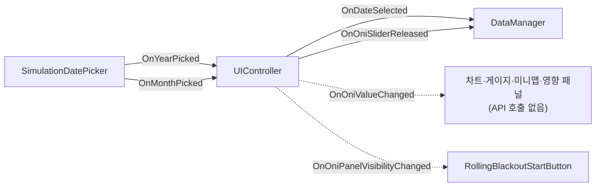
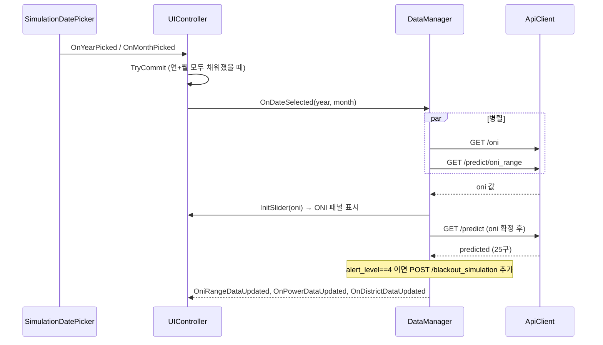

# SmartCity — 서울 기상·전력 시뮬레이터

Unity 기반 서울시 스마트시티 시뮬레이터. ENSO(ONI) 기후 신호와 연도·월을 선택하면
기온 예측 → 전력소비·공급량 예측 → 경보단계 → 블랙아웃 시뮬레이션까지
파이프라인이 실행되고, Unity 씬이 실시간으로 업데이트됩니다.

연월을 선택하지 않으면 **실시간 모드**로 동작하며, HUD에는 오늘 날짜와 `/weather/current` 기온이 표시됩니다.

---

## 목차

1. [프로젝트 목표](#1-프로젝트-목표)
2. [전체 아키텍처](#2-전체-아키텍처)
3. [Unity 이벤트 흐름](#3-unity-이벤트-흐름)
4. [모델 파이프라인](#4-모델-파이프라인)
5. [Unity 구조](#5-unity-구조)
6. [디렉터리 구조](#6-디렉터리-구조)
7. [설치 및 실행](#7-설치-및-실행)
8. [API 명세](#8-api-명세)
9. [시뮬레이션 로직](#9-시뮬레이션-로직)
10. [데이터 현황](#10-데이터-현황)
11. [알려진 데이터 품질 이슈](#11-알려진-데이터-품질-이슈)
12. [데이터 시각화](#12-데이터-시각화)

---

## 1. 프로젝트 목표

| 항목       | 내용                                                         |
| ---------- | ------------------------------------------------------------ |
| 대상 지역  | 서울시 25개 구                                               |
| 시간 범위  | 2005 ~ 2040년 (과거 재현 + 미래 시나리오)                    |
| 기후 변수  | ONI (엘니뇨-라니뇨 지수), 연도·월 선택                       |
| 예측 대상  | 월별 전력소비량(구×용도), 전국 공급량, 공급예비율            |
| 시뮬레이션 | 경보단계 판정, 구별 블랙아웃 순차 차단                       |
| Unity 연동 | Flask REST API → C# HttpClient → 버드뷰 / 정보 패널 업데이트 |

---

## 2. 전체 아키텍처

```
[Unity 씬]
  ├── HUD (날짜·기온·경보단계) — 실시간 / 시뮬레이션 모드
  ├── 연/월 DatePicker (SimulationDatePicker)
  ├── ONI 슬라이더 + 영향 패널 (Panel_ONI_Adjust)
  ├── ONI별 에너지 차트 (XCharts, Panel_ONI_Trend)
  ├── 전력상태 게이지 + 순환 단전 (Panel_Blackout)
  ├── 미니맵 (구 클릭·cmap·블랙아웃 깜박임)
  ├── 구별 에너지 패널 (Panel_Gu_Energy)
  └── Cesium 3D 지도 (구 경계·카메라 이동)
        │  C# HttpClient (ApiClient.cs)
        ▼
[Flask REST API]  python/api/flask_app.py  (포트: 5001)
  ├── GET  /health
  ├── GET  /weather/current
  ├── GET  /oni
  ├── GET  /predict
  ├── GET  /predict/oni_range
  └── POST /blackout_simulation
        │
        ▼
[Python 파이프라인]
  1. 기온 예측 (선형회귀, ASOS 108 기반)
        │
        ▼
     CDD / HDD 변환
        │
     ┌──┴──────────────────┐
     ▼                     ▼
  2. 소비량 예측        3. 공급량/최대전력 예측
     (XGBoost)             (다항 선형회귀)
     구×용도별             → 예비율 수식 계산
     └──┬──────────────────┘
        ▼
     블랙아웃 시뮬레이션
```

---

## 3. Unity 이벤트 흐름

### 3.1 실시간 vs 시뮬레이션 모드

| 모드 | 조건 | API | HUD 날짜 | HUD 기온 |
|------|------|-----|----------|----------|
| **실시간** | 연·월 미선택 (`Year`/`Month` = `-`) | `GET /weather/current` (1시간마다) | `DateTime.Now` → `YYYY - MM` | API 실측 기온 |
| **시뮬레이션** | 연·월 모두 선택 후 `OnDateSelected` | `/oni`, `/predict/oni_range`, `/predict` | `/predict` 응답 연월 | 선택 구(종로) 예측 기온 |

시작 시 자동 predict 호출은 없습니다. 사용자가 연·월을 고른 뒤에만 시뮬레이션 API가 실행됩니다.

### 3.2 전체 이벤트 맵

커스텀 이벤트는 C# `Action` delegate만 사용합니다 (`UnityEvent` / `static event` 없음).

#### 입력 계층 (DatePicker → UIController → DataManager)



#### DataManager 발행 이벤트

```mermaid
flowchart TB
  DM[DataManager]

  DM -->|OnCurrentDataUpdated| InfoPanelUI
  DM -->|OnCurrentDataUpdated| CurrentDataTestUI

  DM -->|OniRangeDataUpdated| XchartUIManager
  DM -->|OniRangeDataUpdated| OniImpactPanel
  DM -->|OniRangeDataUpdated| BlackoutGaugePanel
  DM -->|OniRangeDataUpdated| RollingBlackoutStartButton
  DM -->|OniRangeDataUpdated| MinimapColorController
  DM -->|OniRangeDataUpdated| InfoPanelUI

  DM -->|OnPowerDataUpdated| PowerGridManager
  DM -->|OnPowerDataUpdated| BlackoutSimulationController
  DM -->|OnPowerDataUpdated| BlackoutGaugePanel
  DM -->|OnPowerDataUpdated| MinimapColorController
  DM -->|OnPowerDataUpdated| GuEnergyPanelUI
  DM -->|OnPowerDataUpdated| InfoPanelUI

  DM -->|OnDistrictDataUpdated| DistrictManager
  DM -->|OnDistrictDataUpdated| GuEnergyPanelUI
  DM -->|OnDistrictDataUpdated| InfoPanelUI

  DM -->|OnAllDistrictsParsed| DistrictManager

  DM -->|OnBlackoutSimulationParsed| BlackoutSimulationController
  DM -->|OnBlackoutSimulationParsed| BlackoutLogger
  DM -->|OnBlackoutItemsParsed| BlackoutLogger
```



#### 미니맵 · 블랙아웃 · 빌딩 이벤트

```mermaid
flowchart TB
  MM[MinimapManager]
  BSC[BlackoutSimulationController]
  BM[BuildingManager]

  MM -->|OnDistrictSelected| MainCameraController
  MM -->|OnDistrictSelected| GuEnergyPanelUI
  MM -->|OnDistrictSelected| XchartUIManager
  MM -->|OnDistrictSelected| GuBoundaryDecal

  BSC -->|OnBlackoutSimulationToggled| RollingBlackoutStartButton
  BSC -->|OnBlackoutSimulationToggled| BlackoutGaugePanel
  BSC -->|OnBlackoutSimulationToggled| MinimapColorController
  BSC -->|OnBlackoutSimulationToggled| BlackoutLogger
  BSC -->|OnBlackoutSimulationToggled| MainCameraController
  BSC -->|OnBlackoutSimulationToggled| BuildingManager

  BSC -->|OnBlackoutDistrictChanged| MainCameraController
  BSC -->|OnBlackoutDistrictChanged| MinimapColorController

  BSC -->|OnDistrictBlackedOut| BlackoutLogger
  BSC -->|OnDistrictBlackedOut| BlackoutGaugePanel
  BSC -->|OnDistrictBlackedOut| BuildingManager

  BSC -->|OnSimulationCompleted| RollingBlackoutStartButton
  BSC -->|OnSimulationCompleted| BlackoutGaugePanel
  BSC -->|OnSimulationCompleted| BlackoutLogger

  BM -->|OnDistrictObjectCreated| DistrictManager
```



### 3.3 사용자 상호작용 흐름

#### A. 연·월 선택 (시뮬레이션 시작)



#### B. ONI 슬라이더

| 단계 | 트리거 | 동작 |
|------|--------|------|
| 드래그 중 | `Slider.onValueChanged` → `OnOniValueChanged` | 캐시된 `OniRangeData`로 차트·게이지·미니맵·영향 패널 **즉시** 보간 (API 없음) |
| 손 뗌 | `PointerUp` → `OnOniSliderReleased` | 150ms 디바운스 후 `GET /predict` (+ 필요 시 `/blackout_simulation`) |

#### C. 미니맵 구 클릭

```
MinimapPolygon 클릭
  → MinimapManager.SelectDistrict (아웃라인·툴팁)
  → OnDistrictSelected(districtType)
       ├─ MainCameraController.MoveToClickedDistrict (시뮬 ON이면 무시)
       ├─ GuEnergyPanelUI — 선택 구 도넛·비율
       ├─ XchartUIManager.SetDistrict — 차트 제목·구별 시리즈
       └─ GuBoundaryDecal — 3D Cesium 구 경계 decal
```

미니맵 cmap은 `MinimapColorController`가 `OniRangeDataUpdated` + `OnPowerDataUpdated` 수신 후 적용합니다.  
`MinimapManager`와 `MinimapColorController`는 **같은 GameObject**에 있어야 `SetReady()`가 호출됩니다.

#### D. 순환 단전 시뮬레이션

**전제:** `/predict`의 `alert_level == 4`일 때 `/blackout_simulation` 결과가 `BlackoutSimulationController`에 저장됨.

```
RollingBlackoutStartButton 클릭 (예비율 심각 단계에서만 활성)
  → BlackoutSimulationController.RequestToggle(true)
  → 구 순서대로 RunSimulation():
       OnBlackoutDistrictChanged → 카메라 이동 + 미니맵 깜박임
       OnDistrictBlackedOut      → BlackoutLogger + 게이지 바늘
       BlackoutLogger 완료 대기  → 다음 구
  → OnSimulationCompleted
```

### 3.4 DataManager API 호출 순서

| 시점 | 호출 |
|------|------|
| `Start()` | `WeatherRefreshLoop` — `GET /weather/current` (3600초 주기) |
| `OnDateSelected` | `GET /oni` ∥ `GET /predict/oni_range` → `GET /predict` |
| `OnOniSliderReleased` | `GET /predict` (현재 선택 연·월 + 슬라이더 ONI) |
| `alert_level == 4` | 위 predict 직후 `POST /blackout_simulation` |

---

## 4. 모델 파이프라인

| 단계               | 모델          | 출력                         | 아티팩트                        |
| ------------------ | ------------- | ---------------------------- | ------------------------------- |
| **1. 기온 예측**   | 선형회귀      | 서울 월평균기온 (℃)          | `temp_trend_model.pkl`          |
| **2. 소비량 예측** | XGBoost       | 구×용도별 소비량 (MWh)       | `consumption_xgb.pkl`           |
| **3. 공급량 예측** | 다항 선형회귀 | 공급량(MW) + 최대전력(MW)    | `supply_model.pkl`              |
| **예비율 계산**    | 수식          | (supply−peak) / peak × 100   | —                               |

피처 공통: `year, month, oni, cdd, hdd, district, usage_type`  
학습 진입점: `python -m python.train_pipeline`

---

## 5. Unity 구조

### C# 스크립트 구성

```
Assets/Scripts/
├── Core/
│   ├── Managers/
│   │   ├── BuildingManager.cs       # 구역 건물 메쉬·GPU 렌더링
│   │   ├── DistrictManager.cs       # 구별 데이터 ↔ DistrictObject 집계
│   │   ├── PowerGridManager.cs      # 전력망 데이터 캐시
│   │   └── SimulationManager.cs     # (빈 placeholder)
│   ├── Objects/
│   │   ├── BuildingObject.cs
│   │   └── DistrictObject.cs
│   └── Simulation/
│       ├── BlackoutSimulationController.cs  # 순환 단전 코루틴
│       ├── BlackoutLogger.cs                # 건물유형별 로그 + 진행 게이트
│       └── MainCameraController.cs          # Cesium 카메라 이동
├── Data/
│   ├── ApiClient.cs                 # Flask REST HTTP
│   ├── DataManager.cs               # API 오케스트레이션 + 이벤트 허브
│   ├── DataParser.cs / DataBaker.cs
│   └── Models/                      # PowerGridData, DistrictData, OniRangeData, …
├── UI/
│   ├── Panel_UserInput/
│   │   ├── UIController.cs          # DatePicker·ONI 슬라이더 → 이벤트 발행
│   │   ├── SimulationDatePicker.cs  # 연/월 카드 + 팝업
│   │   └── DatePickerOptionButton.cs
│   ├── Panel_ONI_Adjust/
│   │   └── OniImpactPanel.cs        # ONI 슬라이더 영향 (기온·사용·공급·예비율)
│   ├── Panel_ONI_Trend/
│   │   └── XchartUIManager.cs       # ONI 범위 차트 (구 UIManager 대체)
│   ├── Panel_Blackout/
│   │   ├── BlackoutGaugePanel.cs    # 예비율 도넛·바늘
│   │   ├── PowerStatusPanelUI.cs    # 경보단계 텍스트
│   │   ├── RollingBlackoutStartButton.cs
│   │   └── ReserveRateStagePalette.cs
│   ├── Panel_Gu_Energy/
│   │   └── GuEnergyPanelUI.cs       # 선택 구 에너지 도넛
│   ├── Panel_Info/
│   │   └── InfoPanelUI.cs           # HUD 날짜·기온·경보 dot
│   ├── MiniMap/
│   │   ├── MinimapManager.cs        # GeoJSON 미니맵·클릭
│   │   ├── MinimapColorController.cs # cmap·블랙아웃 깜박임
│   │   ├── MinimapPolygon.cs / MinimapOutline.cs
│   │   └── GuBoundaryDecal.cs       # 3D 구 경계
│   ├── UI_Util/                     # DonutMeshRenderer, DashboardColors, …
│   └── Test/CurrentDataTestUI.cs
└── Utilities/                       # enums, DataConverter, DistrictCoordinates, …
```

> **참고:** `UIManager.cs`는 삭제됨. 차트는 `XchartUIManager`가 담당.  
> `BlackoutGaugePanel`의 canonical 경로는 `UI/Panel_Blackout/`입니다.

### 스크립트 역할 요약

| 파일 | 역할 |
|------|------|
| `UIController` | 연·월·ONI 입력 이벤트 허브 |
| `DataManager` | API 호출·JSON 파싱·데이터 이벤트 발행 |
| `InfoPanelUI` | HUD (실시간 날짜/기온 또는 predict 결과) |
| `XchartUIManager` | ONI 범위 라인 차트 |
| `OniImpactPanel` | 슬라이더 ONI 변화량 4패널 |
| `BlackoutGaugePanel` | 예비율 게이지 + 시뮬 바늘 |
| `MinimapManager` + `MinimapColorController` | 미니맵 UI + 전력 cmap |
| `BlackoutSimulationController` | 순환 단전 시퀀스 |
| `DistrictManager` | 구별 reduction score → GPU |
| `BuildingManager` | C++ 바이너리 → 구역 메쉬 스폰 |

### XCharts 차트 구성

- **Serie 0**: 공급예비율 (강조)
- **Serie 1~3**: 기온 / 공급량 / 소비량
- **MarkArea**: 라니냐 / 중립 / 엘니뇨 배경
- **MarkLine**: 예비율 임계 HLine + 현재 ONI 수직선
- x축: ONI -2.5 ~ +2.5 (51포인트)

---

## 6. 디렉터리 구조

```
SmartCity/
├── .env                             # API 키, FLASK_PORT=5001
├── requirements.txt
├── README.md
│
├── data/
│   ├── extract/                     # 데이터 수집 스크립트
│   ├── file/                        # 원시 데이터
│   └── output/                      # 전처리 결과물
│
├── python/
│   ├── loader/
│   ├── preprocess/
│   ├── train/
│   ├── simulation/
│   ├── api/flask_app.py             # REST API 서버
│   ├── model/                       # 학습 아티팩트 (.pkl)
│   └── train_pipeline.py
│
└── Unity/ElninoEnergyRiskSimulation/
    └── Assets/Scripts/              # C# (섹션 5 참조)
```

---

## 7. 설치 및 실행

### 환경 설정

```bash
pip install -r requirements.txt
```

`.env` 파일 (프로젝트 루트):

```
OPEN_API=your_service_key_here
FLASK_PORT=5001
```

### 모델 학습

```bash
python -m python.train_pipeline
```

### Flask API 서버 실행

```bash
python -m python.api.flask_app
# 포트: 5001 (FLASK_PORT 환경변수)
```

### Unity 실행

- Unity 에디터: `Unity/ElninoEnergyRiskSimulation/`
- Flask 서버 5001 포트 실행 필요
- `ApiClient.serverUrl` = `http://localhost:5001`
- 작업 씬: `Assets/Scenes/UIScene 2.unity`
- `TestPrefab > MinimapManager`에 `MinimapManager` + `MinimapColorController` 동일 GO 배치

---

## 8. API 명세

### `GET /health`

```json
{ "status": "ok" }
```

### `GET /weather/current`

실시간 모드 HUD 기온용.

### `GET /oni?year=&month=`

슬라이더 초기값. 과거면 실측, 미래면 0.0.

```json
{
  "input":  { "year": 2025, "month": 8 },
  "output": { "oni": 1.37 }
}
```

### `GET /predict?year=&month=&oni=`

단일 월 전체 예측 (25구).

### `GET /predict/oni_range?year=&month=`

ONI -2.5 ~ +2.5 (0.1 간격, 51포인트). 차트·슬라이더 보간용.

### `POST /blackout_simulation`

```json
{ "year": 2030, "month": 8, "oni": 1.5 }
```

`alert_level == 4`일 때만 Unity에서 호출.

---

## 9. 시뮬레이션 로직

### 경보단계 (공급예비율 기준)

| 단계            | 예비율   |
| --------------- | -------- |
| NORMAL (정상)   | ≥ 15%    |
| CAUTION (주의)  | 10 ~ 15% |
| WARNING (경계)  | 7 ~ 10%  |
| ALERT (심각)    | 5 ~ 7%   |
| CRITICAL (위기) | < 5%     |

### 블랙아웃 우선순위

경계(ALERT) 이상 단계에서 `reduction_need_score` 내림차순으로 구 → 건물유형 순차 차단.

#### 감축 목표량

| 경보단계 | 서울 전체 소비량 대비 감축 목표 |
| -------- | ------------------------------- |
| 경계     | 15%                             |
| 심각     | 30%                             |

#### `reduction_need_score` 계산 공식

```
reduction_need_score = reduction_need_draft × weight × 100

reduction_need_draft = 용도정규화사용률 × 공급위험도
  - 용도정규화사용률 = 용도별 전력사용율 / 해당 구 최대 전력사용율
  - 공급위험도       = 1 - 공급예비율(%) / 100
```

#### 순회 순서

1. **구(district) 순서**: 구별 `total_consumption_mwh` 내림차순
2. **구 내 순서**: 건물유형별 `reduction_need_score` 내림차순
3. 누적 감축량이 목표에 도달하면 중단

---

## 10. 데이터 현황

| 데이터                   | 경로                                            | 범위                | 상태    |
| ------------------------ | ----------------------------------------------- | ------------------- | ------- |
| ASOS 시간별 기상 (108)   | `data/file/asos_weather_data/`                  | 2005 ~ 2026         | ✅ 완료 |
| KEPCO 구별·용도별 판매량 | `data/file/kepco_electricity_sales/`            | 2005 ~ 2026         | ✅ 완료 |
| EPSIS 전국 공급량·예비율 | `data/file/epsis_supply_rate_final_20052026.csv`| 2005 ~ 2026         | ✅ 완료 |
| ONI 월별 지수            | `data/file/oni.csv`                             | 1950 ~ 현재         | ✅ 완료 |
| AWS 구별 일별 기온       | `data/file/aws_weather_data/`                   | 2020 ~ 2026         | ✅ 완료 |

---

## 11. 알려진 데이터 품질 이슈

| 이슈                  | 원인                                     | 적용된 수정                                   |
| --------------------- | ---------------------------------------- | --------------------------------------------- |
| MWh/kWh 단위 불일치   | 2013→2014년 기준 변경                    | `detect_unit()`으로 파일별 판별 후 ×1000 변환  |
| `"심 야"` 내부 공백   | 2015년 이후 xlsx 포맷 변경               | `.str.replace(r'\s+', '', regex=True)`         |
| 2021 판매실적 파일    | 시군구별 분리 불가 포맷                  | `is_valid_fixed()`에서 명시 제외               |
| ONI-예비율 허위 상관  | 연도별 설비 증설 사이클이 교란변수로 작용 | 예비율 직접 학습 대신 수식 계산으로 변경       |

---

## 12. 데이터 시각화

### 분석 개요

- 분석 지역: 서울특별시
- 분석 기간: 2005 ~ 2026
- 활용 데이터: 기상(기온·습도·풍속), 전력 사용량, 공급예비율, ONI

### 1) 기후 변수 특성 분석

<p align="center">
  
</p>

### 2) 연도별 CDD · HDD · THI 변화

<p align="center">
  
</p>

### 3) 자치구별 CDD / HDD

<p align="center">
  
</p>

### 4) 연도·월별 전력수요 및 공급예비율

<p align="center">
  
</p>

### 5) 자치구별 전력 수요 분포

<p align="center">
  
</p>

### 6) ENSO ONI 장기 변동

<p align="center">
  
</p>

### 7) 전력사용량 ↔ 기후 변수 상관

<p align="center">
  
</p>

---

## 주요 참고 자료

- KMA 기상자료개방포털: [data.kma.go.kr](https://data.kma.go.kr)
- KEPCO 전력판매 현황: [한국전력 통계](https://home.kepco.co.kr)
- EPSIS 전력통계정보시스템: [epsis.kpx.or.kr](https://epsis.kpx.or.kr)
- ONI (Oceanic Niño Index): [NOAA CPC](https://origin.cpc.ncep.noaa.gov)
